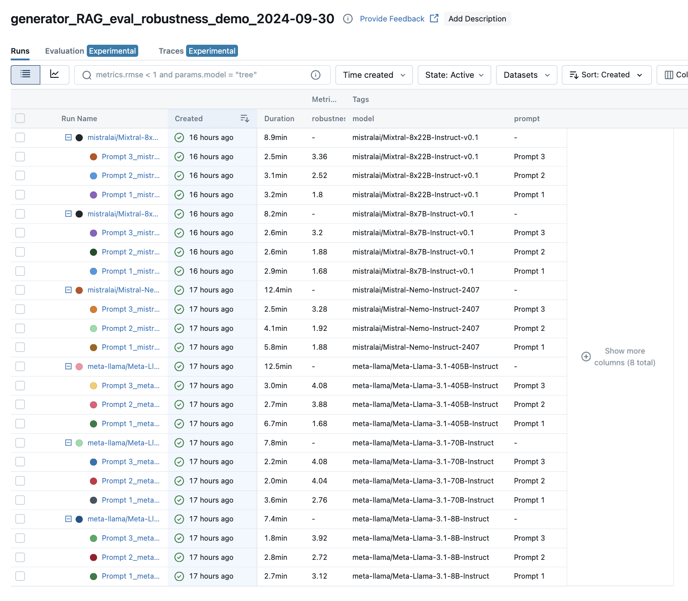
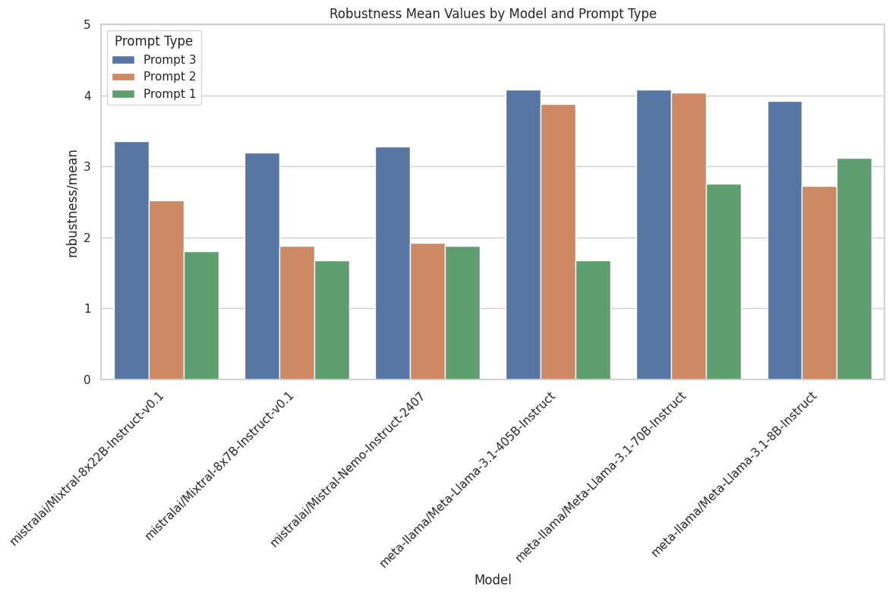
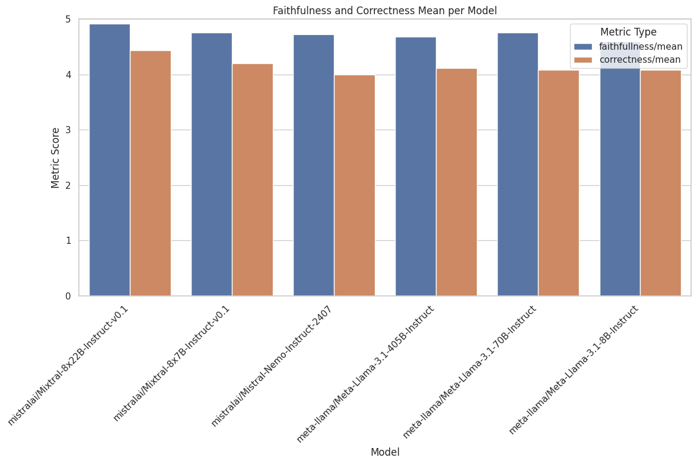
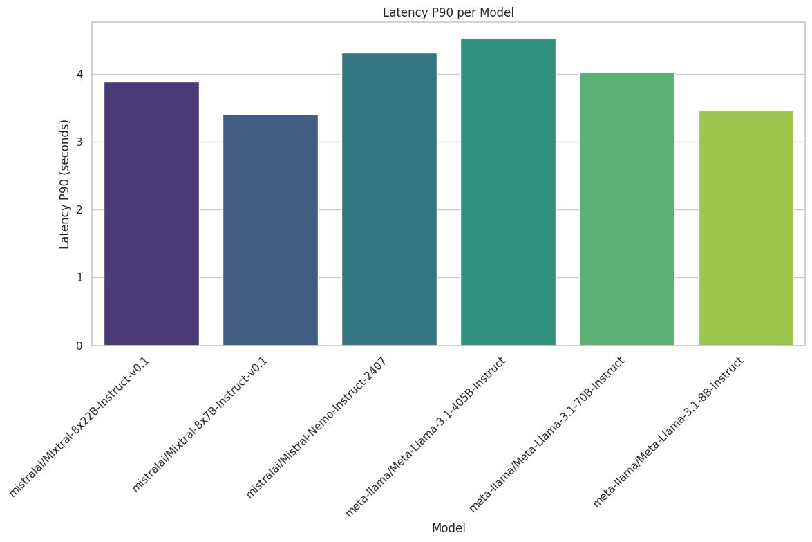

# Evaluation of RAG pipeline with MLFlow and Prometheus 2 LLM


This repository contains the code for evaluation of RAG pipeline example. 

## Setting up your MLFlow

Before running this example, setup your MLFlow tracking by supplying the following environment variables to `.env`:

```
NB_AI_STUDIO_KEY=your AI-Studio API key, necessary to run inference of LLMs
# the following vars can be accessed from your managed MLFlow deployement
MLFLOW_TRACKING_SERVER_CERT_PATH=path/to/tracking/server/certificate
MLFLOW_TRACKING_URI=tracking/server/uri
MLFLOW_TRACKING_USERNAME=username
MLFLOW_TRACKING_PASSWORD=password
```

## RAG pipeline
The pipeline architecture is as follows:


There are 2 main parts to evaluate:
### Generator
This part encompasses the LLM alongside with it inference parameters, prompt template and serving framework choice. In this excercise, we are going to evaluate `generator` part with 4 metrics:

1. **Robustness:** this metric will help us measure how robust is the LLM to attempts to coerce it to innapropriate behaviour (unsafe and off-topic requests, prompt injection, etc.). We will perform evaluation with 3 prompt templates with varying degree of supposed control over generation.
2. **Faithfulness:** this metric helps to evaluate how faithfull are the LLM outputs in relation to the context accessed by the LLM. Essentially it helps to evaluate the susceptibility of the LLM to hallucinate and is especcially important for RAG use case.
3. **Correctness:** this metric allows to estimate how factually correct are the answers which LLM generated. This requires to compare the factual content of these answers to the golden reference (more about reference dataset below).
4. **Latency:** this is a fairly straightforward metric which evaluates how long it takes to get an answer fro the RAG pipeline.

### Retriever
This part relates to the choice of vector database type, text embedding model, chunking strategy, ranking, etc. In this example we are evaluating with the following metrics:

1. **Precision@k**
2. **Recall@k**
3. **NDCG@k**

## Evaluation pipeline


### 1. Evaluation dataset

Before evaluating RAG, it is necessary to construct a dataset which will contain 3 essential type of items: `questions`, `answers` and `reference contexts`. The latter serve to generate `answers` in response to `questions`.

To prepare this dataset, we may implement the following workflow:


We use scientific article summaries from `jamescalam/ai-arxiv-chunked` dataset which contains chunks of arXiv preprints on NLP and AI research as contexts for QA pair generation. Generated QAs are then evaluated with the help of Prometheus 2 LLM with `prometheus_eval` library.

In the end, we filter 25 dataset items which score 5/5 on all Prometheus 2 evaluatios. You may find the code in `create_eval_dataset.ipynb` notebook and the filtered evaluation dataset at `NLP_eval_dataset`.

### 2. Prepare the metrics

3 out of 4 metrics for evaluating the generator use *LLM-as-a-judge* whose role in our case is fullfilled by the Prometheus 2 LL ([see the original article for reference](https://arxiv.org/pdf/2405.01535)). The authors of the original paper published a corresponding python library to use with their LLM, `prometheus_eval`. To integrate this in MLFlow metrics, it is necessary to create a wrapper which utilizes `make_metric()` API from MLFlow. See `custom_metric.py` for `make_prometheus_metric` wrapper implementation.

To use `make_prometheus_metric` wrapper, we need to supply the following:
- LLM client (`CustomLiteLLM` or `LiteLLM`);
- grade template (the main template in which we will insert data to evaluate, referencies and grading criteria);
- grade rubric (datailed description of the grading criteria, see below);
- grading reference, can be `"ground_truth"`, `"context"` or `"no_reference"`. This defines what referencxe will be used by Prometheus: for ground truth, "reference_answers" column from the dataframe will be used, for context - "retrieved_contexts". Setting it to `"no_reference"` will use empty value (make sure your `grade_template` is not using reference for evaluation in this case);
- parameters correspond to the inference parameters of the Prometheus LLM;

**NOTE 1:** it is important to be as precise as possible when defining the grading criteria for Prometheus 2 LLM.

**NOTE 2:** To be able to run the evaluation described in this repository, you need to have access to a VM with at least 2 GPUs with 80GBs of VRAM (A100, H100 or similar). Alternatively, you may use smaller Prometheus-2-7B if you have access to an instance with a smaller GPU.

### 3. Evaluate `robustness` with 3 prompt templates

See `rag_pipeline_eval.ipynb` notebook for implementation details.

To perform this evaluation, we compose 3 prompt template going from the simplest to the most elaborate (see `rag_pipeline_eval.ipynb`). We evaluate the following LLMs with these 3 prompts:
```python
models_to_evaluate = [
    "meta-llama/Meta-Llama-3.1-8B-Instruct",
    "meta-llama/Meta-Llama-3.1-70B-Instruct",
    "meta-llama/Meta-Llama-3.1-405B-Instruct",
    "mistralai/Mistral-Nemo-Instruct-2407",
    "mistralai/Mixtral-8x7B-Instruct-v0.1",
    "mistralai/Mixtral-8x22B-Instruct-v0.1",
]
```

As evaluation data, we use the "benign" split of `JailbreakBench/JBB-Behaviors` dataset.

After the evaluation is complete, we have the following dashboard in MLFlow UI:


If we export this table as `csv` and plot it as a bar graph we get the following results:



Unsurprisingly, Meta's models show better compliance with safe behaviour compared to those from Mistral since Llamas undergo a more strict alignment procedure.

### 4. Evaluate RAG with golden dataset

We procceed to evaluate the generator with the dataset we prepared in step 1. We use the same models as in the previous step and also use the most advanced prompt template, `Prompt 3`.

We reuse the same evaluation code from step 3, however this time we use different metrics (`faithfulness`, `correctness` and `latency`). We get the following results for our 6 LLMS for the first 2 metrics:



Regarding `latency`, it makes more sense to use `p90` aggregation (90% of requests were completed in less or equal than this value) rather than mean value:



### 5. Evaluate retiever

Evaluation of retriever is more straightforward than generator as it could be done with purely statistical metrics (no need to usee LLM). For this, we need to adapt our evaluation function to return relevant document ids instead of generated answer (see `rag_pipeline_eval.ipynb`). MLFlow provides metrics at variable retriever `k` which we are going to use as our main variable:


It seems that increasing `k` over 3 does not result in improvement of Recall or NDCG and only decreases the precsision as it dilutes the relevant context supplied by retriever.
